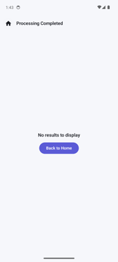
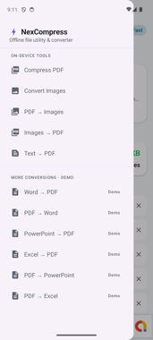
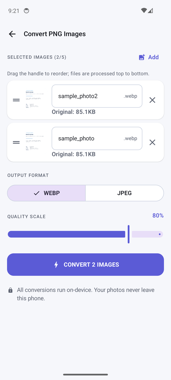
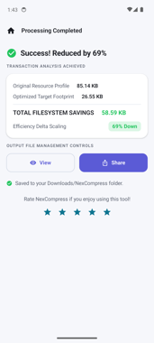

<div align="center">

# ⚡ NexCompress

**A privacy-first, offline file utility & converter for Android.**

Compress PDFs, convert images, and turn files between formats — almost entirely
**on-device**, with no account and no servers in the loop.

[](https://github.com/KrishBahukhandi/NexCompressor/actions/workflows/android.yml)


</div>

---

## ✨ Features

Every tool runs **on-device** — your files never leave the phone (the only
network use was ads, which are **currently disabled**).

### Core tools (home screen)
| Tool | Description |
|------|-------------|
| **Compress PDF** | Recompresses the images inside the document (Recommended / Smallest / Best-quality profiles) while text & vectors stay sharp — never produces a larger file. |
| **Images** | Pick up to 5 photos, edit each (rotate / flip / crop / resize), then export as **JPG / PNG / WebP** files **or** combine them into a single **PDF**. Per-image rename, drag-to-reorder. |
| **Edit & sign PDF** | Add text, draw with a pen, highlight, and drop a finger-drawn **signature** on any page. Pick font / size / colour; tap a placed item to edit or drag to move. |
| **Edit PDF pages** | Reorder (drag), rotate, or delete pages, then export — lossless. |

### More tools (drawer)
| Tool | Description |
|------|-------------|
| **Export PDF** | Turn a PDF into page **images** (JPG / PNG / WebP) **or** a **PowerPoint** deck (one full-bleed slide per page). |
| **Text → PDF** | Lay a `.txt` file out into a clean, paginated A4 PDF. |
| **Merge PDFs** | Concatenate several PDFs into one (reorderable). |
| **Split PDF** | Extract a chosen set of pages into one PDF, or burst every page into its own file. |
| **Protect PDF** | Lock a PDF with a password (AES/standard security) or unlock a protected one — the password never leaves the device. |

The PDF tools run on an on-device [PDFBox-Android](https://github.com/TomRoush/PdfBox-Android)
engine; the lossless ones keep text selectable.

### Document conversions (drawer)
Run **fully on-device** (content-faithful; complex layout simplified):
**Word → PDF**, **Excel → PDF**, and **PDF → Word** — text-focused, with on-device
**OCR** via Google ML Kit so scanned/image-only PDFs convert too (the model is
bundled, nothing is uploaded). Modern formats only (.docx/.xlsx/.pdf).

> PowerPoint → PDF and PDF → Excel had no faithful offline path and were removed;
> the pluggable `RestConversionService` remains in the codebase for a future keyed
> deployment but isn't surfaced.

### Throughout
- 🔗 **Share-to** — send a photo, PDF, or text file from any app's share sheet straight into NexCompress (a single shared PDF asks which tool to use).
- 📊 **Performance ledger** — cumulative storage reclaimed + file history (Room), split across a **Home / History** bottom nav.
- ⏳ **Cancellable jobs**, with an "X of Y" progress bar for multi-file work.
- ✏️ Rename / 🔗 share / 👁 preview / 💾 save-a-copy any output; files land in `Downloads/NexCompress`. **Originals are never modified** — every result is a new file.
- 🔒 Scoped-storage compliant via the **Storage Access Framework** — **no runtime storage permissions**.
- ℹ️ **About & privacy** screen — offline-first statement, permission rationale, and an in-app FAQ.
- 💰 AdMob banner + interstitial are wired but **currently switched off** via a one-line kill switch (`AdsConfig.ENABLED`).

## 📱 Screenshots

| Home & ledger | Conversion suite | Image batch | Results |
|:---:|:---:|:---:|:---:|
|  |  |  |  |

## 🏗️ Architecture

Clean, decoupled layers with lightweight **manual DI** (no annotation-processing
DI framework) and a single-Activity Jetpack Compose UI:

```
com.nexcompress.app
├── data/
│   ├── local/        # Room entity, DAO, database (history ledger)
│   ├── processor/    # PdfCompressor, ImageConverter, ImageEditor, ImageTransforms, PdfToImage,
│   │                 #   ImagesToPdf, TxtToPdf, PdfAnnotator, PdfPageEditor, PdfMerger, PdfSplitter,
│   │                 #   PdfProtector, OfficeConverter (+OcrEngine), FileStorageManager
│   ├── remote/       # OnlineConversionService + RestConversionService (configurable)
│   └── repository/   # HistoryRepository
├── domain/model/     # Sealed CompressionState, enums, result models
├── di/               # AppContainer (manual DI)
├── ads/              # AdManager + AdMobManager + AdsConfig (master kill switch)
└── ui/               # Compose screens (incl. images/, about/, share/), navigation, theme, shared ViewModel
```

- **Heavy work** runs on Kotlin Coroutines (`Dispatchers.IO`); every bitmap/stream/PDF
  path is guarded against OOM & corruption, and jobs are **cancellable**.
- **State** is a sealed `CompressionState` (`Idle / Loading / Success / Error`).
- **No backend** except the AdMob SDK and the optional, pluggable conversion service.

## 🧰 Tech stack

Kotlin 2.0 · Jetpack Compose (Material 3) · Coroutines · Room · Navigation-Compose ·
[PDFBox-Android](https://github.com/TomRoush/PdfBox-Android) (offline PDF engine) ·
Google ML Kit (on-device OCR) · Google Mobile Ads · AGP 8.7 / Gradle 8.9 ·
`minSdk 26`, `compileSdk 35`.

## 🚀 Build & run

**Requirements:** JDK 17, Android SDK (Platform 35 + Build-Tools 35).

```bash
# Point the build at your SDK (or open in Android Studio, which writes this)
echo "sdk.dir=$HOME/Library/Android/sdk" > local.properties

./gradlew :app:assembleDebug
# → app/build/outputs/apk/debug/app-debug.apk
```

> `local.properties` is intentionally **git-ignored** (machine-specific).

## 🌐 Online conversions

The online Office conversions use a **provider-agnostic REST client** configured at
build time — secrets stay out of version control:

```properties
# ~/.gradle/gradle.properties  (NOT committed)
CONVERT_API_KEY=your_api_key
CONVERT_BASE_URL=https://v2.convertapi.com   # default; any compatible endpoint works
```

- **No key** → built-in **demo mode** (simulated round-trip + labelled placeholder PDF).
- **Key set** → real multipart upload → convert → download.
- Swap providers (CloudConvert, self-hosted Gotenberg, your own proxy) by implementing
  `OnlineConversionService` — the UI doesn't change.

> **Production note:** a `BuildConfig` key is embedded in the APK and can be extracted.
> For release, route these calls through a thin backend proxy that holds the key.

## 📣 AdMob

Banner + interstitial are wired with Google's **official test** ad-unit IDs and
sample App ID, but **currently switched off** via `AdsConfig.ENABLED = false`
(`ads/AdsConfig.kt`). To monetize: flip it to `true`, then replace the test IDs
(and the `APPLICATION_ID` in `AndroidManifest.xml`) with your own.

## 🔗 Privacy & support

- **Privacy policy** — <https://krishbahukhandi.github.io/NexCompressor_website/#privacy>
- **Support** — <https://krishbahukhandi.github.io/NexCompressor_website/#support>

Both are also linked from the in-app **About & privacy** screen.

## 🌿 Branching model

| Branch | Purpose |
|--------|---------|
| `main` | Production-ready, release-tagged. Protected. |
| `develop` | Integration branch for ongoing work. |
| `backup` | Safety mirror of `main`. |
| `feature/*`, `fix/*` | Short-lived topic branches → PR into `develop`. |

Releases are tagged `vMAJOR.MINOR.PATCH` (e.g. `v1.0.0`).

## 📄 License

Proprietary — © 2026 Krish Bahukhandi. All rights reserved. See [LICENSE](LICENSE).
